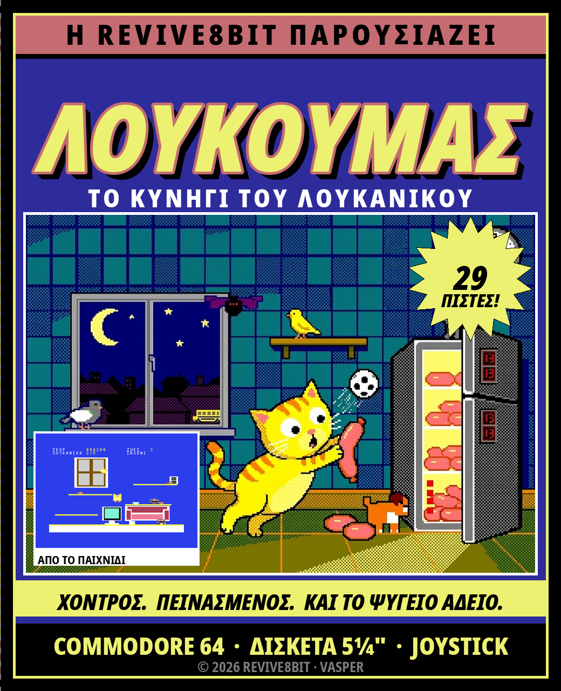
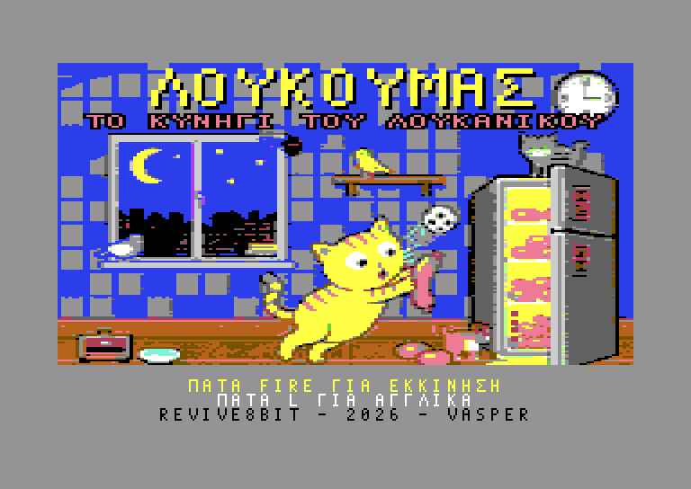
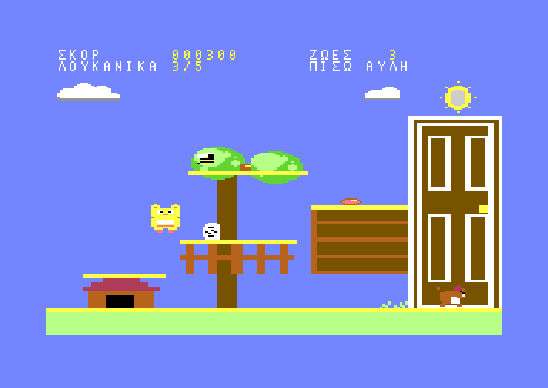
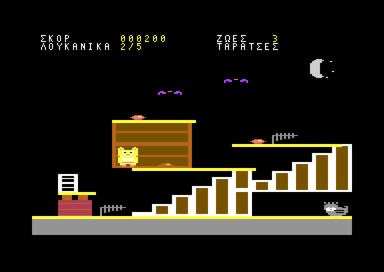
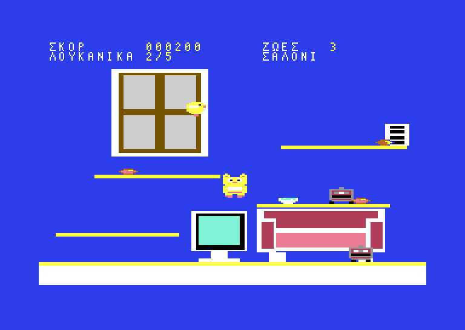
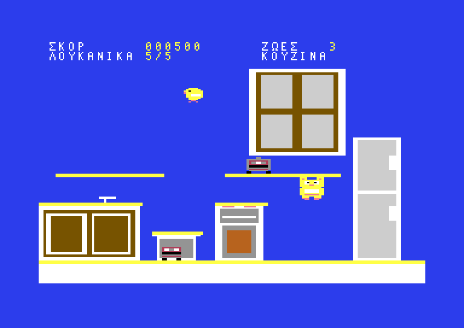
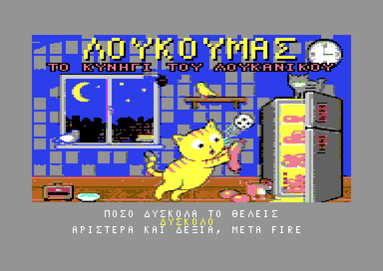
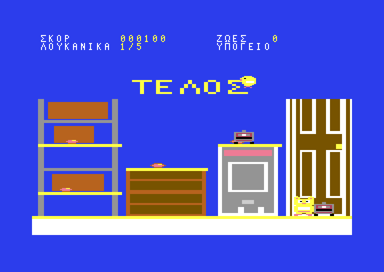

# ΛΟΥΚΟΥΜΑΣ
## ΤΟ ΚΥΝΗΓΙ ΤΟΥ ΛΟΥΚΑΝΙΚΟΥ

**COMMODORE 64 · ΔΙΣΚΕΤΑ 5¼" · JOYSTICK Ή ΠΛΗΚΤΡΟΛΟΓΙΟ**

*Μια παραγωγή REVIVE8BIT · © 2026*



> In English: [MANUAL.en.md](MANUAL.en.md) · Βιβλιαράκι:
> [PDF στα ελληνικά](docs/manual-el.pdf), [PDF in English](docs/manual-en.pdf)

---

## ΦΟΡΤΩΣΗ

1. Ανάψτε πρώτα τον οδηγό δισκέτας και μετά τον Commodore 64.
2. Βάλτε τη δισκέτα στον οδηγό, με την ετικέτα προς τα πάνω, και κλείστε το
   μοχλό.
3. Γράψτε

   ```
   LOAD"*",8
   ```

   και πατήστε `RETURN`. Όταν γράψει `READY.`, γράψτε

   ```
   RUN
   ```

   και πατήστε ξανά `RETURN`.
4. Η οθόνη μαυρίζει για λίγα δευτερόλεπτα, και μετά εμφανίζεται η οθόνη της
   REVIVE8BIT όσο φορτώνει το παιχνίδι.
5. Περίπου είκοσι δευτερόλεπτα αργότερα έρχεται η αρχική οθόνη και αρχίζει η
   μουσική.

Σε **1541** ή **1541-II** φορτώνει με τη δική του γρήγορη φόρτωση. Σε
οποιονδήποτε άλλο οδηγό — SD2IEC, 1571 — φορτώνει κι εκεί, με την κανονική
ταχύτητα: υπολογίστε ενάμισι λεπτό.

**Μην** κλείσετε τίποτα και μην ανοίξετε τον οδηγό όσο ανάβει το λαμπάκι του.

*Οποιοσδήποτε C64 ή C64C, PAL ή NTSC. Το joystick μπαίνει στη θύρα 2 — ή
αφήστε το και παίξτε με το πληκτρολόγιο.*



---

## Η ΙΣΤΟΡΙΑ ΜΕΧΡΙ ΕΔΩ

Είναι τρεις και τέταρτο τα ξημερώματα, στο διαμέρισμα της κυρα-Ευδοκίας στην
Κυψέλη. Όλοι κοιμούνται. Όλοι εκτός από έναν.

Ο **Λουκουμάς** — αφράτος, υπέρβαρος γάτος ράτσας European Shorthair, με κοντά
ποδαράκια, τεράστια μάτια και ακόρεστη αγάπη για τα αλλαντικά — ξύπνησε από το
ίδιο του το στομάχι. Η κυρα-Ευδοκία όμως τον έβαλε σε δίαιτα, και το σπίτι δεν
είναι πια δικό του: μια σκούπα-ρομπότ κάνει περιπολίες στο πάτωμα όλη νύχτα,
και το καναρίνι της, ο **Τουίτι-Μπόξερ**, πετάει ελεύθερο από δωμάτιο σε
δωμάτιο.

Ο Λουκουμάς ξεκινάει από το υπόγειο με έναν σκοπό: να ανέβει ως την κουζίνα και
να ανοίξει το μεγάλο δίπορτο Pitsos.

**Και το βρίσκει άδειο.**

Το τελευταίο, το μεγάλο, πήγε σχολείο στο ταπεράκι της **Μυρτώς**, της εγγονής
της κυρα-Ευδοκίας. Απ' έξω ακούγεται το σχολικό να παίρνει μπρος.

Από εκεί και πέρα δεν είναι επιδρομή· είναι κυνήγι, και κρατάει άλλες δεκαεννιά
πίστες: έξω από την πίσω αυλή, μέσα από τη γειτονιά, μέσα από όλο το σχολείο,
ως το κτηνιατρείο — και πίσω σπίτι από τις ταράτσες, κάτω από την καμινάδα, στο
δικό του τζάκι, όπου η Μυρτώ του έχει αφήσει ένα μπολ με γάλα.





**Είκοσι εννιά πίστες. Εννιά ζωές — ή τρεις, αν τις ζητήσετε. Ένα λουκάνικο.**

---

## ΧΕΙΡΙΣΜΟΣ

Joystick στη θύρα 2 ή πληκτρολόγιο — όποιο θέλετε, όποτε θέλετε.

| Πληκτρολόγιο | Joystick | Τι κάνει |
|---|---|---|
| `O` `P` | αριστερά / δεξιά | Βάδισμα |
| `Q` ή `SPACE` | πάνω ή fire | Άλμα |
| `A` | κάτω | **Roll** — μαζεύεται σε μπάλα |
| `A` + `SPACE` στον αέρα | κάτω + fire | **BELLY-FLOP** |
| `L` (μόνο στην αρχική) | — | Ελληνικά / Αγγλικά |
| `SPACE` (αρχική οθόνη) | fire | Εκκίνηση |
| `RUN/STOP` | — | Εγκατάλειψη, πίσω στην αρχική οθόνη |

Το **roll** είναι και πιο γρήγορο από το βάδισμα και **πιο κοντό** από το
όρθιο. Υπάρχουν περάσματα σε αυτό το παιχνίδι όπου ο όρθιος Λουκουμάς δεν
χωράει. Αξιοπρέπεια δεν υπάρχει. Ούτως ή άλλως δεν υπήρχε από την αρχή.

### ★ ΤΟ BELLY-FLOP ★

Πηδήξτε, και ενώ είστε στον αέρα κρατήστε κάτω (`A`) και πατήστε fire
(`SPACE`). Ο Λουκουμάς μαζεύεται, πέφτει σαν σακί με αλεύρι και προσγειώνεται
με την κοιλιά. **Τραντάζεται όλο το δωμάτιο** — και ό,τι βρίσκεται περίπου στο
ύψος που προσγειώθηκε ζαλίζεται επιτόπου, όσο μακριά κι αν είναι πάνω στο
ράφι.

Δεν είναι φιγούρα. Είναι η απάντηση σε ένα ρομπότ που περιπολεί ολόκληρο ράφι
και δεν σας αφήνει να πλησιάσετε το λουκάνικο στην άκρη του. Κάντε flop, και
περάστε από πάνω του όσο βλέπει αστεράκια.

**Πώς γίνεται**

* Πρέπει να είστε **στον αέρα** — στην άνοδο, στην κορυφή ή στην πτώση. Αν
  βγείτε περπατώντας από την άκρη ενός ραφιού, μετράει όσο κι ένα άλμα. Στο
  έδαφος το κάτω είναι roll και τίποτε άλλο.
* Κρατήστε πρώτα κάτω και μετά **πατήστε** fire. Αν κρατάτε ακόμα πατημένο το
  fire από το άλμα, δεν γίνεται τίποτα: θέλει καινούργιο πάτημα ενώ κρατάτε
  κάτω. Με το πάνω δεν γίνεται — μόνο με το fire.
* Από τη στιγμή που μαζεύτηκε, δεν γυρίζει πίσω. Πέφτει ίσια κάτω με όλη του
  την ταχύτητα, και μπορείτε ακόμα να τον στρίψετε λίγο αριστερά ή δεξιά.

**Πού φτάνει**

* Η ζάλη γίνεται **με την προσγείωση**, όχι όταν πατάτε το κουμπί. Αν κάνετε
  flop στον αέρα πάνω από ένα ρομπότ, μετράει το ράφι όπου θα πέσετε.
* Φτάνει **σε όλο το πλάτος του δωματίου**. Η απόσταση πάνω στο ράφι δεν παίζει
  κανέναν ρόλο.
* Φτάνει **περίπου ένα ράφι πάνω και ένα κάτω**: το ράφι όπου προσγειωθήκατε,
  το ακριβώς από πάνω και το ακριβώς από κάτω. Ό,τι είναι δύο ράφια μακριά
  συνεχίζει κανονικά.
* Πιάνει και ό,τι πετάει, αν βρίσκεται μέσα σε αυτή τη ζώνη τη στιγμή της
  προσγείωσης. Ένα καναρίνι που περνάει σταματάει στη μέση της πτήσης του.

**Τι κάνει, και για πόσο**

* Ένας ζαλισμένος εχθρός **μένει εκεί που είναι, αναβοσβήνει γκρίζος και δεν
  σας βλάπτει**. Περάστε μέσα από αυτόν, σταθείτε στο ράφι του, πάρτε το
  λουκάνικο πίσω του.
* Μένει ζαλισμένος **δύο, τρία ή τέσσερα δευτερόλεπτα**, ανάλογα με τη
  δυσκολία (δείτε *ΠΟΣΟ ΔΥΣΚΟΛΑ ΤΟ ΘΕΛΕΤΕ*). Δεν προειδοποιεί όταν συνέρχεται —
  απλώς ξαναρχίζει να κινείται, και από εκείνη τη στιγμή είναι επικίνδυνος.
* Ένα δεύτερο flop ξεκινάει το ρολόι από την αρχή, σε όλη του τη διάρκεια, για
  ό,τι είναι μέσα στη ζώνη.
* **Το πληρώνει και ο Λουκουμάς**: για περίπου ένα τέταρτο του δευτερολέπτου
  μετά την προσγείωση μένει φαρδύς-πλατύς και δεν ακούει τα χειριστήρια. Ό,τι
  είναι ξύπνιο και εκτός ζώνης — ένα πουλί δύο ράφια πιο πάνω, ας πούμε —
  μπορεί ακόμα να τον πιάσει εκεί.

*Ένας ζαλισμένος εχθρός είναι ακίνδυνο σκηνικό — μέχρι να σηκωθεί.*

---

## Η ΟΘΟΝΗ ΣΑΣ

Δύο σειρές στην κορυφή, και είναι το μόνο κομμάτι της οθόνης που δεν είναι το
παιχνίδι:

```
ΣΚΟΡ       000500          ΖΩΕΣ   3
ΛΟΥΚΑΝΙΚΑ  5/5             ΚΟΥΖΙΝΑ
```

| | |
|---|---|
| **ΣΚΟΡ** | Έξι ψηφία. Δεν μηδενίζει από πίστα σε πίστα |
| **ΖΩΕΣ** | Εννιά, έξι ή τρεις, ανάλογα με τη δυσκολία που διαλέξατε. Τόσες είναι και το πολύ |
| **ΛΟΥΚΑΝΙΚΑ** | Πόσα από τα πέντε της πίστας έχετε βρει |
| **Όνομα πίστας** | Πού βρίσκεστε. Και οι είκοσι εννιά έχουν όνομα |



Όταν ένα μπολ με γάλα σας δίνει πίσω μια ζωή, **το περιθώριο της οθόνης
αναβοσβήνει κίτρινο**. Είναι το μόνο πράγμα στην οθόνη που δεν μπορεί να σας
ξεφύγει την ώρα που σας κυνηγάνε.

---

## ΤΙ ΨΑΧΝΕΤΕ

**ΛΟΥΚΑΝΙΚΑ — πέντε σε κάθε πίστα, 100 πόντοι το ένα.**
Μαζέψτε και τα πέντε και η έξοδος της πίστας — πόρτα, εξαερισμός, ψυγείο,
καμινάδα — **αλλάζει** και γίνεται πέρασμα. Μέχρι τότε είναι έπιπλο. Δεν
χρειάζεται καμία σειρά, και τίποτα δεν ξαναγυρίζει όταν χάνετε ζωή: μια πίστα
μόνο πιο εύκολη γίνεται.

**ΤΟ ΜΠΟΛ ΜΕ ΤΟ ΓΑΛΑ — σε κάθε τρίτη πίστα.**
Οι πίστες 3, 6, 9, 12, 15, 18, 21, 24 και 27 έχουν ένα. Αξίζει πάντα **500
πόντους**, κι αν έχετε χάσει ζωή σας δίνει και μία πίσω — ποτέ όμως πάνω από
όσες ξεκινήσατε. Αξίζει πολύ περισσότερο από τη στιγμή που θα αρχίσετε να τις
χάνετε, και στο δύσκολο — όπου είχατε μόνο τρεις εξαρχής — ακόμα περισσότερο.



Είναι πάντα στο πιο άβολο ράφι της πίστας, και συνήθως σε αυτό που περιπολεί
κάποιος. Η έξοδος δεν το περιμένει: μπορείτε να τελειώσετε την πίστα και να το
αφήσετε. Αν αξίζει, είναι θέμα ανάμεσα σε εσάς και τις ζωές που σας έμειναν.

---

## ΤΙ ΨΑΧΝΕΙ ΕΣΑΣ

Τρεις σε κάθε πίστα. Η επαφή με οποιονδήποτε κοστίζει μία ζωή και σας βάζει
πίσω στην αρχή της πίστας με **δύο δευτερόλεπτα ασυλίας** — όσο κρατάνε, ο
γάτος αναβοσβήνει — για να φύγετε από τη μέση.

Στο παιχνίδι υπάρχουν μόνο δύο συμπεριφορές — κάτι που περπατάει σε ράφι και
κάτι που πετάει σε τόξο. Μάθετε τις δύο και τα ξέρετε και τα δώδεκα:

| | Περπατάει | Πετάει | Πού |
|---|:---:|:---:|---|
| Σκούπα-ρομπότ | ● | | το σπίτι |
| Το καναρίνι | | ● | το σπίτι |
| Ο σκύλος του διπλανού | ● | | αυλή, πεζοδρόμιο, κτηνιατρείο |
| Περιστέρι | | ● | πάρκο, δρόμος, ταράτσες |
| Σφήκα | | ● | όπου υπάρχουν λουλούδια |
| Μπάλα | ● | | παιδική χαρά, γυμναστήριο, γήπεδο |
| Χάρτινο αεροπλανάκι | | ● | το σχολείο |
| Ο κουβάς του επιστάτη | ● | | το σχολείο |
| Κάτι πράσινο | ● | | το χημείο |
| Σύριγγα | | ● | το κτηνιατρείο |
| Νυχτερίδα | | ● | ταράτσες, καμινάδα |
| Ο αδέσποτος γάτος | ● | | ταράτσες, πάρκινγκ |

Κανείς δεν σας πυροβολεί. Κανείς δεν σας ακολουθεί. Δεν χρειάζεται — οι πίστες
είναι μικρές και εσείς δεν είστε γρήγορος.

---

## ΠΟΣΟ ΔΥΣΚΟΛΑ ΤΟ ΘΕΛΕΤΕ

Μετά την αρχική οθόνη, και πριν από την πρώτη πίστα, το παιχνίδι ρωτάει.
Αλλάξτε με αριστερά και δεξιά (`O` και `P`), δεχτείτε με fire (`SPACE`).



| | Ζωές | Οι εχθροί | Η ζάλη από το belly-flop |
|---|:---:|---|---|
| **ΕΥΚΟΛΟ** | 9 | στη μισή ταχύτητα· ό,τι πετάει, στο ένα τρίτο | τέσσερα δευτερόλεπτα |
| **ΜΕΣΑΙΟ** | 6 | στα δύο τρίτα· ό,τι πετάει, στη μισή | τρία δευτερόλεπτα |
| **ΔΥΣΚΟΛΟ** | 3 | κανονικά | δύο δευτερόλεπτα |

**Το ΔΥΣΚΟΛΟ είναι το παιχνίδι όπως σχεδιάστηκε** — τρεις ζωές, και όλα να
κινούνται με την ταχύτητα που σχεδιάστηκαν. Το εύκολο και το μεσαίο δεν κάνουν
τον Λουκουμά γρηγορότερο ούτε τις πίστες πιο βολικές: σας δίνουν περισσότερες
ζωές και περισσότερο χρόνο να σκεφτείτε. Το άλμα είναι το ίδιο άλμα, τα ράφια
στην ίδια απόσταση, και κάθε λουκάνικο στην ίδια θέση.

---

## ΒΑΘΜΟΛΟΓΙΑ

| | |
|---|---|
| Λουκάνικο | 100 |
| Μπολ με γάλα | 500 — και μία ζωή πίσω, αν έχετε χάσει |

Δεν υπάρχει μπόνους χρόνου ούτε μπόνους τέλους πίστας. Το σκορ είναι ό,τι
μαζέψατε.

---

## ΟΤΑΝ ΤΕΛΕΙΩΝΕΙ

Χάστε και την τελευταία ζωή και η πίστα παγώνει εκεί που είναι, με το **ΤΕΛΟΣ**
γραμμένο από πάνω. Πατήστε fire (`SPACE`) για καινούργιο παιχνίδι από την
πρώτη πίστα με την ίδια δυσκολία, ή `RUN/STOP` για να γυρίσετε στην αρχική
οθόνη — και μαζί στα μενού γλώσσας και δυσκολίας.



Περάστε και τις είκοσι εννιά και παίρνετε ένα **ΜΠΡΑΒΟ!**, που το 1986
θεωρούνταν γενναιόδωρο.

---

## ΣΥΜΒΟΥΛΕΣ ΑΠΟ ΤΟΥΣ ΔΟΚΙΜΑΣΤΕΣ

* **Κοιτάξτε πριν πηδήξετε.** Το άλμα καθαρίζει περίπου είκοσι εννιά γραμμές
  και τα ράφια απέχουν είκοσι τέσσερις, άρα κάθε ράφι φτάνεται από το από κάτω
  του — αλλά μόνο από το από κάτω του.
* **Τα ράφια είναι μονής κατεύθυνσης.** Προσγειώνεστε πάνω τους πέφτοντας, και
  τα περνάτε από κάτω ανεβαίνοντας. Αυτό είναι διαδρομή, όχι bug: ανεβείτε μέσα
  από αυτό που δεν μπορείτε να παρακάμψετε.
* **Το flop είναι κλειδί, όχι όπλο.** Τίποτα σε αυτό το παιχνίδι δεν πεθαίνει.
  Ένα ράφι που δεν περνιέται είναι ένα ράφι που δεν του έχετε κάνει ακόμα flop.
* **Πάρτε το γάλα όταν σας λείπει μία-δύο ζωές.** Με όλες τις ζωές είναι μόνο
  πόντοι· με μία λιγότερη είναι ο δρόμος της επιστροφής. Στο δυσκολότερο ράφι
  της πίστας είναι έτσι κι αλλιώς.
* **Μάθετε πού γυρίζει το καναρίνι.** Ό,τι πετάει, αναπηδάει για πάντα ανάμεσα
  στους ίδιους δύο τοίχους. Σταθείτε εκεί από όπου μόλις πέρασε.
* **Το roll από κάτω είναι συνήθως πιο γρήγορο από το άλμα από πάνω** — και
  πάντα πιο ασφαλές από το να προσγειωθείτε επάνω του.
* **Το RUN/STOP δεν είναι παύση.** Παύση δεν υπάρχει. 1986 ήταν.

---

## ΓΙΑ ΟΣΟΥΣ ΤΟΥΣ ΕΝΔΙΑΦΕΡΕΙ Η ΤΕΧΝΙΚΗ ΠΛΕΥΡΑ

Οι πίστες είναι **multicolour bitmap**, 160 διπλά pixels επί 184 γραμμές, με
το σκορ από πάνω σε απλό κείμενο: η οθόνη αλλάζει τρόπο λειτουργίας σε μία
γραμμή του raster στην κορυφή και ξαναγυρίζει στο περιθώριο, σε κάθε καρέ. Ένα
κελί multicolour είναι τέσσερα pixels επί οκτώ και δείχνει μόνο τέσσερα
χρώματα, οπότε κάθε πίστα ζωγραφίζεται κουτί-κουτί μέσα από έναν «διανομέα»
που μοιράζει τα χρώματα κάθε κελιού όπως τα ζητάει η πίστα — κι ένας έλεγχος
που τρέχει τους ίδιους κανόνες αρνείται να φτιάξει το παιχνίδι αν βγει λάθος
έστω κι ένα κελί σε οποιαδήποτε από τις είκοσι εννιά πίστες.

Ο γάτος και οι τρεις εχθροί είναι **hardware sprites**, δύο για κάθε εικόνα,
το ένα πάνω στο άλλο για ένα δεύτερο χρώμα: και τα οκτώ sprites της μηχανής,
σε κάθε καρέ. Το παιχνίδι σκέφτεται και ζωγραφίζει πενήντα φορές το
δευτερόλεπτο· σε μηχανή NTSC παραλείπει ένα βήμα στα έξι, ώστε όλα να κρατάνε
την ταχύτητά τους σε δευτερόλεπτα.

Η δισκέτα φορτώνει με δική της **γρήγορη φόρτωση**: ένα πρόγραμμα που μπαίνει
στη μνήμη του 1541, βρίσκει μόνο του τα αρχεία και τα στέλνει δύο bits τη
φορά, περίπου δέκα φορές πιο γρήγορα από το KERNAL. Η μουσική του τίτλου είναι
το τραγούδι της έκδοσης για Amstrad από το Arkos Tracker, διαβασμένο από τα
δεδομένα του και παιγμένο σε δύο από τις φωνές του **SID**· η τρίτη είναι των
ηχητικών εφέ.

Και οι δύο γλώσσες είναι στο ίδιο πρόγραμμα, και το `L` ξαναγράφει μόνο τα
γράμματα, όχι την οθόνη.

Το πώς οδηγείται η μηχανή είναι στο [CLAUDE.md](CLAUDE.md)· το σχέδιο που
ακολούθησε η μεταφορά είναι στο [loukc64.md](loukc64.md).

---

## ΣΥΝΤΕΛΕΣΤΕΣ

|  |  |
|---|---|
| Κώδικας, γραφικά και σχεδιασμός | **VASPER** |
| Μουσική | Η μουσική της έκδοσης Amstrad (Arkos Tracker 3), στον SID |
| Έκδοση | **REVIVE8BIT**, 2026 |

*Ο Λουκουμάς είναι γάτα. Κανένα λουκάνικο δεν έπαθε κακό κατά τη δημιουργία
αυτού του παιχνιδιού. Το ίδιο δεν ισχύει για τη δίαιτα.*
