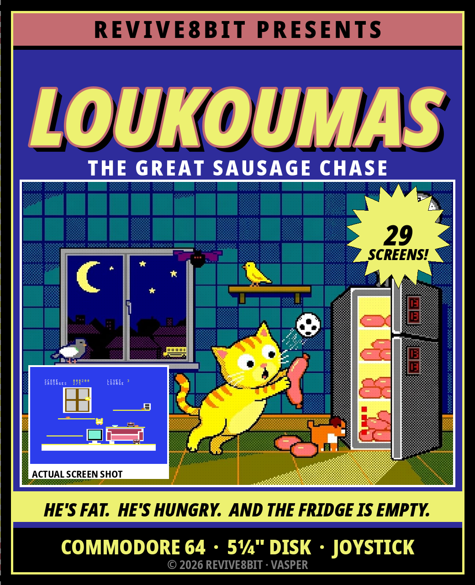
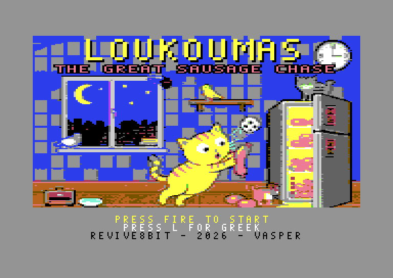
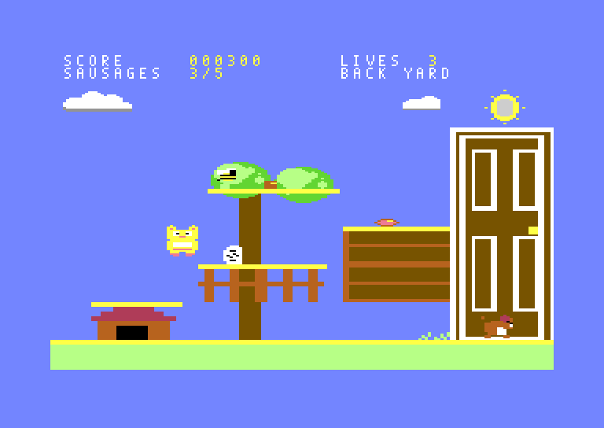
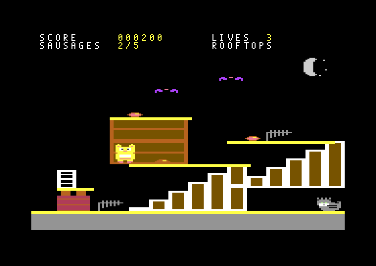
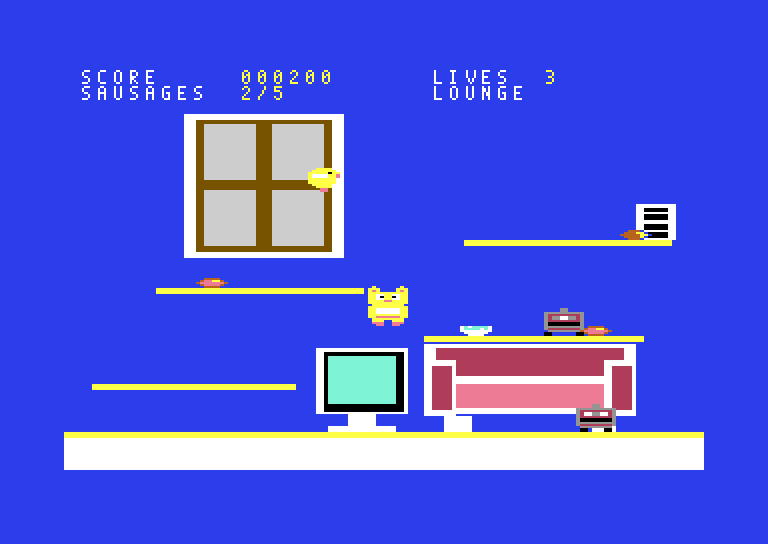
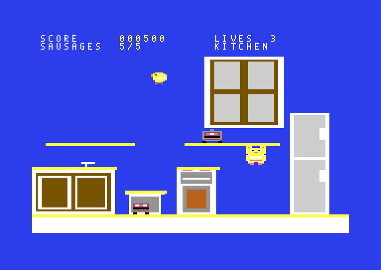
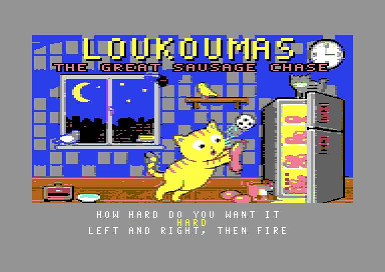
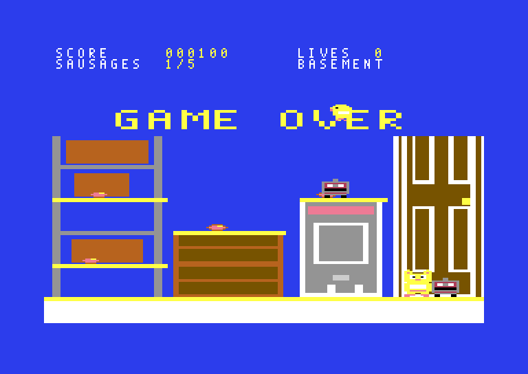

# LOUKOUMAS
## THE GREAT SAUSAGE CHASE

**COMMODORE 64 · 5¼" DISK · JOYSTICK OR KEYBOARD**

*A REVIVE8BIT production · © 2026*



> Ελληνικά: [MANUAL.el.md](MANUAL.el.md) · Booklet:
> [English PDF](docs/manual-en.pdf), [Greek PDF](docs/manual-el.pdf)

---

## LOADING

1. Switch on the disk drive, then the Commodore 64.
2. Put the disk in the drive, label side up, and close the latch.
3. Type

   ```
   LOAD"*",8
   ```

   and press `RETURN`. When it says `READY.`, type

   ```
   RUN
   ```

   and press `RETURN` again.
4. The screen goes black for a few seconds, then the REVIVE8BIT screen comes
   up while the game loads.
5. About twenty seconds later the title screen appears and the music starts.

It loads through its own fast loader on a **1541** or **1541-II**. Any other
drive — an SD2IEC, a 1571 — still loads it, at the ordinary speed: count on
a minute and a half.

**Do not** switch anything off or open the drive while its light is on.

*Any C64 or C64C, PAL or NTSC. Plug the joystick into port 2 — or leave
it out and use the keyboard.*



---

## THE STORY SO FAR

It is a quarter past three in the morning in Mrs Evdokia's flat in Kypseli.
Everybody is asleep. Everybody except one.

**Loukoumas** — a plump, overweight European Shorthair with short legs, enormous
eyes and an unappeasable love of cured meats — has been woken by a rumble in
his own stomach. Mrs Evdokia has put him on a diet, and the house is no longer
his: a robot vacuum patrols the floors all night, and her canary, the
**Tweety-Boxer**, has the run of every room.

Loukoumas starts in the basement with one intention: to climb all the way up to
the kitchen and open the big two-door Pitsos.

**And he finds it empty.**

The last one, the big one, went to school in the lunchbox of **Myrto**, Mrs
Evdokia's granddaughter. Outside, the school bus is starting its engine.

From there it stops being a raid and becomes a chase, and it lasts another
nineteen rooms: out through the back yard, across the neighbourhood, through
the whole school, into the vet's — and home over the rooftops and down the
chimney into his own fireplace, where Myrto has left him a bowl of milk.





**Twenty-nine rooms. Nine lives — or three, if you ask for them. One sausage.**

---

## THE CONTROLS

Joystick in port 2 or the keyboard — either, at any time.

| Keyboard | Joystick | What it does |
|---|---|---|
| `O` `P` | left / right | Walk |
| `Q` or `SPACE` | up or fire | Jump |
| `A` | down | **Roll** — curl into a ball |
| `A` + `SPACE` in mid-air | down + fire | **BELLY-FLOP** |
| `L` (title screen only) | — | Switch between Greek and English |
| `SPACE` (title screen) | fire | Start |
| `RUN/STOP` | — | Abandon the game and go back to the title |

**Rolling** is faster than walking *and* shorter than standing. There are gaps
in this game that a standing cat does not fit through. There is no dignity in
it. There is no dignity in any of this.

### ★ THE BELLY-FLOP ★

Jump, then hold down (`A`) and hit fire (`SPACE`) while you are still in the
air. Loukoumas tucks in, drops like a sack of flour and lands flat on his
stomach. **The whole room shakes** — and everything at roughly the height he
landed at is stunned where it stands, however far along the shelf it happens
to be.

This is not a trick. It is the answer to a robot that patrols a whole shelf and
will not let you near the sausage on the end of it. Flop, then walk straight
through it while it sees stars.

**How to do it**

* You have to be **in the air** — on the way up, at the top, or falling. Walking
  off the edge of a shelf counts as much as a jump does. On the ground, down is
  a roll and nothing else.
* Hold down first, then **press** fire. Holding fire down from the jump does
  nothing: it has to be a fresh press while down is held. Up will not do it —
  only fire.
* Once he has tucked in there is no taking it back. He drops at full speed,
  straight down, and still drifts left and right if you steer.

**Where it reaches**

* The stun goes off **on landing**, not when you press the button. Flop in
  mid-air over a robot and it is the shelf you come down on that counts.
* It reaches **sideways across the whole room**. Distance along the shelf does
  not matter at all.
* It reaches **up and down by about one shelf**: the shelf you landed on, the
  one just above it and the one just below. Anything two shelves away keeps
  coming.
* Things in the air are caught too, if they are inside that band at the moment
  you land. A canary on its way through stops dead in mid-flight.

**What it does, and for how long**

* A stunned enemy **stops where it is, blinks grey and cannot hurt you**. Walk
  through it, stand on its shelf, take the sausage behind it.
* It stays down for **two, three or four seconds**, depending on the difficulty
  (see *HOW HARD DO YOU WANT IT*). There is no warning when it gets up — it
  simply starts moving again, and from that moment it is dangerous.
* Flop again and the clock starts again, at full length, for everything in reach.
* **Loukoumas pays for it too**: for about a quarter of a second after landing
  he lies flat and does not answer the controls. Anything awake and out of
  reach — a bird two shelves up, say — can still catch him there.

*A stunned enemy is harmless scenery — but only until it gets back up.*

---

## YOUR SCREEN

Two rows across the top, and they are the only part of the screen that is not
the game:

```
SCORE     000500          LIVES   3
SAUSAGES  5/5             KITCHEN
```

| | |
|---|---|
| **SCORE** | Six digits. It does not reset between rooms |
| **LIVES** | Nine, six or three, depending on the difficulty you chose. That number is also the most you can hold |
| **SAUSAGES** | How many of this room's five you have found |
| **Room name** | Where you are. All twenty-nine have one |



When a saucer of milk gives you a life back, **the border flashes yellow**.
It is the only thing on the screen that you cannot miss while you are being
chased.

---

## WHAT YOU ARE AFTER

**SAUSAGES — five in every room, 100 points each.**
Take all five and the way out of the room — a door, a vent, a fridge, a
chimney — **changes** and becomes a way through. Until then it is furniture.
You do not have to find them in any order, and nothing comes back if you lose
a life, so a room only ever gets easier.

**THE SAUCER OF MILK — every third room.**
Rooms 3, 6, 9, 12, 15, 18, 21, 24 and 27 have one. It is always worth **500
points**, and if you have lost a life it gives one back as well — but never
more than the number you started the game on. It is worth a great deal more
once you have started losing them, and on hard, where you only ever had
three, more still.



It is always on the most awkward shelf in the room, and usually on the one
something is patrolling. The way out does not wait for it: you can finish the
room and leave it behind. Whether that is the right call is between you and
your remaining lives.

---

## WHAT IS AFTER YOU

Three in every room. Touching any of them costs a life and puts you back at the
start of the room with **two seconds of grace** — the cat blinks while it
lasts — to get out of the way.

Everything in this game either walks a shelf or flies an arc across the room.
Learn the two and you have learned all twelve:

| | Walks | Flies | Where |
|---|:---:|:---:|---|
| Robot vacuum | ● | | the flat |
| The canary | | ● | the flat |
| Next door's terrier | ● | | back yard, pavement, the vet's |
| Pigeon | | ● | park, street, rooftops |
| Wasp | | ● | anywhere with flowers |
| Football | ● | | playground, gym, pitch |
| Paper plane | | ● | the school |
| The caretaker's bucket | ● | | the school |
| Something green | ● | | the chemistry lab |
| Syringe | | ● | the vet's |
| Bat | | ● | rooftops, chimney |
| The stray tom | ● | | rooftops, car park |

Nothing shoots at you. Nothing follows you. They do not have to — the rooms are
small and you are not fast.

---

## HOW HARD DO YOU WANT IT

After the title screen, and before the first room, the game asks. Use left
and right (`O` and `P`) to change it and fire (`SPACE`) to accept.



| | Lives | Enemies | The belly-flop stun lasts |
|---|:---:|---|---|
| **EASY** | 9 | Half speed; things that fly, a third | Four seconds |
| **MEDIUM** | 6 | Two thirds; things that fly, half | Three seconds |
| **HARD** | 3 | Full speed | Two seconds |

**HARD is the game as it was designed** — three lives, and everything moving at
the speed it was drawn to move at. Easy and medium do not make Loukoumas faster
or the rooms kinder: they give you more lives and longer to think. The jump is
the same jump, the shelves are the same distance apart, and every sausage is in
the same place.

---

## SCORING

| | |
|---|---|
| Sausage | 100 |
| Saucer of milk | 500 — and a life back, if you have lost one |

There is no time bonus and no end-of-room bonus. The score is what you picked
up.

---

## WHEN IT ENDS

Lose your last life and the room stops where it stands with **GAME OVER**
across it. Press fire (`SPACE`) to start again from the first room at the
same difficulty, or `RUN/STOP` to go back to the title screen — and to the
language and difficulty menus with it.



Get through all twenty-nine and you get **WELL DONE!**, which in 1986 was
considered generous.

---

## HINTS FROM THE PLAYTESTERS

* **Look before you jump.** The jump clears about twenty-nine lines and the
  shelves are twenty-four apart, so every shelf is reachable from the one below
  it — but only from the one below it.
* **Platforms are one-way.** You land on a shelf falling, and you pass straight
  up through it rising. That is a route, not a bug: go up through the thing you
  cannot walk around.
* **The flop is a key, not a weapon.** Nothing in this game dies. A shelf you
  cannot cross is a shelf you have not flopped on yet.
* **Take the milk when you are down a life or two.** Untouched it is only
  points; one short, it is the way back up. It is on the hardest shelf in the
  room either way, and you will not want to go back for it on your last one.
* **Learn where the canary turns.** Everything that flies bounces between the
  same two walls for ever. Stand where it has just been.
* **Rolling under something is usually faster than jumping over it**, and it is
  always safer than landing on it.
* **RUN/STOP is not a pause.** There is no pause. It was 1986.

---

## FOR THE TECHNICALLY MINDED

The rooms are a **multicolour bitmap**, 160 double-width pixels by 184 lines,
with the score above them in ordinary text: the screen changes mode on one
raster line at the top and back again in the border, every frame. A
multicolour cell is four pixels by eight and can show only four colours, so
every room is drawn box by box through an allocator that hands out each
cell's colours as the room asks for them — and a checker that runs the same
rules refuses to build the game if a single cell in any of the twenty-nine
rooms comes out wrong.

The cat and the three enemies are **hardware sprites**, two to a picture, one
laid over the other for a second colour: all eight of the machine's sprites,
every frame. The game thinks and draws fifty times a second; on an NTSC
machine it skips one step in six, so everything keeps its speed in seconds.

The disk loads through a **fast loader** of its own: a program put into the
1541's memory that finds the files itself and sends them two bits at a time,
about ten times what the KERNAL manages. The title music was written for
the **SID**: all three of its voices, with a slide whistle, chords played as
fast arpeggios, and a snare made of noise. In the game the sound effects
have the chip to themselves.

Both languages are in the same program, and `L` repaints the lettering rather
than the screen.

How the machine is driven is in [CLAUDE.md](CLAUDE.md); the plan the port
followed is [loukc64.md](loukc64.md).

---

## CREDITS

|  |  |
|---|---|
| Code, graphics and design | **VASPER** |
| Music | Written for the SID |
| Published by | **REVIVE8BIT**, 2026 |

*Loukoumas is a cat. No sausages were harmed in the making of this game. The
same cannot be said for the diet.*
